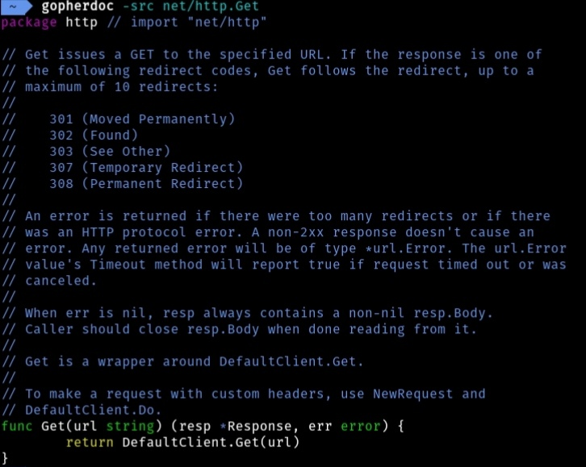

# GopherDoc
Improved `go doc` with terminal syntax highlighting.

This is a modification of the original `go doc` command that adds terminal syntax highlighting.



Uses [go-colorable](https://github.com/mattn/go-colorable) so colors will work on Windows as well.

## Install
```sh
$ git clone https://github.com/ravener/gopherdoc
$ cd gopherdoc
$ go install
```
It will install into `$GOPATH/bin/gopherdoc` (Use `go env GOPATH` to find your path) hopefully that's probably in your `PATH` already.

## Usage
Usage is the same as `go doc` with just a new flag available.

`-style` allows to change the syntax highlighting style, the style must be a valid [chroma](https://github.com/alecthomas/chroma) style. (e.g `gopherdoc -style monokai encoding/json`)

You may also set the style via `GDOC_STYLE` environment variable, so you can e.g set that in your `.bashrc` or something. The flag will still take precedence when available.

The default style is `vim`

## License
Because I modified Go's `cmd/doc` I decided to release it under Go's license. See [LICENSE](LICENSE)
